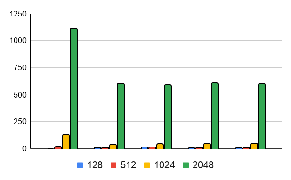

# Projeto de Sistemas Distribuidos - 2VA (Multiplicação de Matriz Distribuida)

### Informação
- **Curso:** Sistemas de Informação
- **Disciplina:** Projeto de Sistemas Distribuidos
- **Discente**: Vinícius Pereira dos Santos (normanwhittlecliff)
- **Título**: Atividade 08 - 2VA Distributed Matrix Multiplication
- **Project ID**: 260614
- **Language**: Python

### IMPORTANTE

Aqui está o link do código no GITHUB. Por favor, considere ver o projeto lá, já que o mesmo, apesar de em inglês, está mais organizado e até melhor explicado:

[Repositório no GITHUB:](https://github.com/normanwhittlecliff/260312-Projeto-de-Sistemas-Distribuidos-PSD/tree/main/Atividade%2008%20-%20Projeto%20PSD%202VA/260618-Distributed-Matrix-Multiplication)

https://github.com/normanwhittlecliff/260312-Projeto-de-Sistemas-Distribuidos-PSD/tree/main/Atividade%2008%20-%20Projeto%20PSD%202VA/260618-Distributed-Matrix-Multiplication

**IMPORTANTE** Os arquivos envolvendo as matrizes de 2048x2048 não aparecerão no GITHUB, já que existe um limite para o quão grande um arquivo pode ser enviado lá, e os arquivos desta matrix ultrapassam os 30MB.

---

## Descrição do Programa

Desenvolvido pelo aluno Vinícius Pereira dos Santos (Norman Santos), o seguinte relatório relata a aplicação desenvolvida em Python que tem com objetivo a multiplicação de matrizes sequencial, paralela e distribuída, desenvolvida para o curso de **Projeto de Sistemas Distribuídos**.

Este projeto compara diferentes estratégias de execução para multiplicação de matrizes, desde uma implementação tradicional em um único processo até uma arquitetura distribuída capaz de delegar computação entre múltiplas máquinas.

O principal objetivo deste projeto é analisar o impacto do paralelismo e da distribuição no tempo de execução da multiplicação de matrizes.

### Variações

O projeto implementa cinco variações de execução:

#### **P1** – Processamento Sequencial

A multiplicação é executada inteiramente por um único processo. Não ocorre divisão da carga de trabalho. Processo único. Sem paralelismo. Menor sobrecarga. Serve como linha de base para comparação.

#### **P2** – Multiprocessamento Utilizando o Número de Núcleos da CPU

A carga de trabalho é dividida entre um número de processos de trabalho igual ao número de núcleos da CPU disponíveis na máquina. Número de processos = núcleos da CPU. Execução paralela. Distribuição balanceada da carga de trabalho.

#### **P3** – Multiprocessamento Utilizando o Dobro do Número de Núcleos da CPU

A carga de trabalho é dividida entre o dobro do número de núcleos da CPU disponíveis. Maior grau de paralelismo. Aumento da sobrecarga de escalonamento. Potencial sobrecarga de troca de contexto.

#### **P4** – Multiprocessamento Utilizando Metade do Número de Núcleos da CPU

A carga de trabalho é dividida entre metade dos núcleos da CPU disponíveis. Sobrecarga reduzida. Menos paralelismo. Menor competição por recursos da CPU. 

#### **P5** – Processamento Distribuído

Uma arquitetura mestre-trabalhador é empregada.

O nó mestre:

- Lê matrizes.
- Divide a carga de trabalho.
- Envia tarefas para trabalhadores remotos.
- Recebe resultados parciais.
- Reconstrói a matriz final.

Os nós trabalhadores:

- Recebem partições da matriz.
- Realizam multiplicações.
- Retornam resultados parciais.

Características:

- Execução distribuída
- Sobrecarga de comunicação em rede
- Escalabilidade em múltiplas máquinas

### Ambiente Trabalhado

O aplicativo foi desenvolvido e executados nos seguintes ambientes:

Desktop:

| Componentes            | Especificação            |
| -------------------- | ------------------------ |
| Operating System     | Windows 11               |
| Programming Language | Python 3               |
| Processor            | Ryzen 5 3400g       |
| RAM                  | 16GB      |
| Logical CPU Cores    | 8 |

Laptop:

| Componentes            | Especificação            |
| -------------------- | ------------------------ |
| Operating System     | Windows 10               |
| Programming Language | Python 3               |
| Processor            | i3 6100u       |
| RAM                  | 4GB      |
| Logical CPU Cores    | 2 |

### Dados Trabalhados

As Matrizes trablahdas possúem o seguintes tamanhos: 

* 128 × 128
* 256 × 256
* 512 × 512
* 1024 × 1024
* 2048 × 2048

---

## Gráfico Comparativo

---

### Copmparação de Tempo Executado

O tempo de execução de cada variação foi medido e comparado.

| Matrix Size | P1 | P2 | P3 | P4 | P5 |
| ----------- | -- | -- | -- | -- | -- |
| 128 × 128   | 0.225  	| 4.918  	| 9.531  	| 2.812  | 1.521  |
| 512 × 512   | 15.560  | 8.134  	| 11.652  	| 7.664  | 5.387  |
| 1024 × 1024 | 129.836  | 40.223  	| 43.42  	| 48.163  | 47.461  |
| 2048 × 2048 | 1113.091  | 597.887  | 584.622  | 603.095  | 599.674  |

---

###  Gráfico de Tempo Executado

Neste gráfico, cada grupo representa uma variação, onde as cores, de acordo com a legenda, representam a matrix calculada e a sua altura indica o tempo, em segundos, que cada variação demorou. 

No primeiro grupo, por exemplo, a cor azul nem aparece, já que seu processo foi, praticamente, instantâneo. Entretanto, na matriz verde, seu processamento durou quase 20 minutos

O gráfico ilustra como o tempo de execução evolui à medida que as dimensões da matriz aumentam.

Para matrizes pequenas, os tempos de execução de todas as implementações tendem a ser semelhantes, pois a carga computacional é relativamente baixa. Nesses cenários, a sobrecarga associada à criação e comunicação de processos pode superar os benefícios do paralelismo.

À medida que o tamanho da matriz aumenta, o custo computacional torna-se dominante, tornando as abordagens paralelas e distribuídas mais vantajosas. A versão sequencial apresenta o aumento mais significativo no tempo de execução, pois todos os cálculos são realizados por um único processo.

## Descrição e Explicação

### P1 – Execução Sequencial

P1 geralmente apresenta o melhor desempenho para matrizes pequenas, pois não há sobrecarga de criação de processos, sincronização ou comunicação. Todos os cálculos ocorrem dentro de um único processo, evitando custos adicionais de gerenciamento.

No entanto, à medida que as dimensões da matriz aumentam, o tempo de execução cresce rapidamente, pois apenas um núcleo da CPU realiza os cálculos.

---

### P2 – Execução Paralela Utilizando Núcleos da CPU

P2 geralmente demonstra melhorias significativas de desempenho para matrizes médias e grandes. A carga de trabalho é distribuída uniformemente entre os núcleos da CPU disponíveis, permitindo que vários cálculos sejam executados simultaneamente.

Embora o ganho de velocidade teórico se aproxime do número de núcleos disponíveis, um ganho de velocidade linear perfeito raramente é alcançado devido à sobrecarga de criação de processos, comunicação entre processos e agregação de resultados.

---

### P3 – Execução Paralela Utilizando o Dobro do Número de Núcleos da CPU

P3 frequentemente apresenta desempenho semelhante ou pior que P2.

Embora mais processos sejam criados, o número de unidades físicas de processamento permanece inalterado. Isso leva a um aumento na troca de contexto, sobrecarga adicional de agendamento e maior consumo de memória.

Como resultado, criar mais processos do que núcleos de CPU disponíveis não necessariamente melhora o desempenho e pode até reduzi-lo.

---

### P4 – Execução Paralela Usando Metade do Número de Núcleos de CPU

P4 geralmente tem um desempenho melhor do que P1, mas pior do que P2.

Como há menos processos disponíveis para executar a carga de trabalho simultaneamente, o nível de paralelismo é reduzido. No entanto, a sobrecarga de sincronização e gerenciamento também é menor.

Dependendo do tamanho da matriz e das características do hardware, P4 pode ocasionalmente atingir um desempenho comparável ao de P2.

---

### P5 – Execução Distribuída

P5 introduz custos de comunicação em rede que não existem em soluções de multiprocessamento local.

Para matrizes pequenas, a sobrecarga de comunicação pode exceder o tempo de computação, fazendo com que P5 tenha um desempenho pior do que as implementações locais.

Para matrizes maiores, no entanto, a capacidade de distribuir a carga de trabalho entre vários computadores pode reduzir significativamente o tempo total de execução.

A eficácia do P5 depende de:

* Latência da rede
* Largura de banda da rede
* Número de máquinas de trabalho
* Tamanho da matriz
* Especificações de hardware dos nós de trabalho

## Conclusão

Este projeto demonstrou a aplicação prática de técnicas de multiprocessamento e processamento distribuído à multiplicação de matrizes.

Os resultados confirmam que dividir uma tarefa computacionalmente intensiva entre múltiplas unidades de processamento pode reduzir significativamente o tempo de execução quando a carga de trabalho é suficientemente grande. Os experimentos também destacam que o paralelismo introduz sobrecarga adicional, o que significa que melhorias de desempenho não são garantidas para problemas de pequeno porte.

A relação entre tempo de computação e sobrecarga de comunicação é uma das considerações mais importantes em sistemas distribuídos. Uma solução distribuída bem-sucedida deve garantir que os ganhos de desempenho obtidos por meio da execução paralela superem os custos associados à coordenação e comunicação.

Entre as abordagens testadas, a implementação usando um número de processos igual aos núcleos de CPU disponíveis geralmente proporcionou o melhor equilíbrio entre utilização de recursos e tempo de execução. A execução distribuída mostrou o maior potencial de escalabilidade, mas também introduziu custos de comunicação que afetaram o desempenho para matrizes menores.

Em geral, o projeto demonstrou com sucesso como as técnicas de computação distribuída e paralela podem ser aplicadas para acelerar a multiplicação de matrizes, ilustrando conceitos fundamentais de Sistemas Distribuídos, incluindo particionamento de carga de trabalho, sincronização, gerenciamento de processos, escalabilidade e computação remota.
